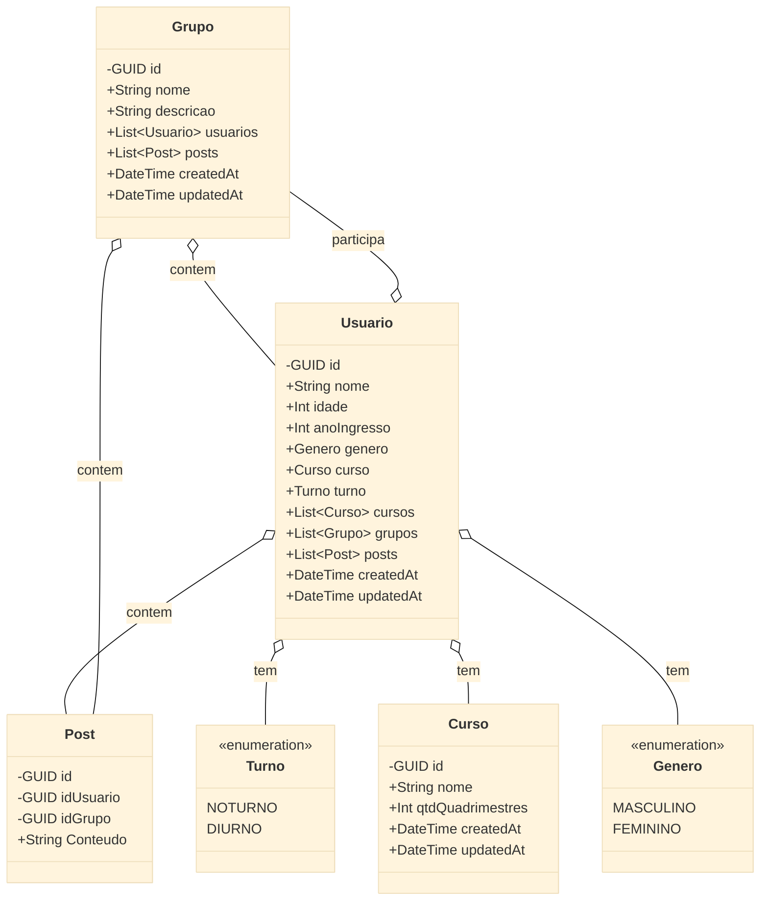

### Diagrama de Classes

```mermaid
    %%{init: {'theme':'base'}}%%
    classDiagram
        class Genero{
            <<enumeration>>
            MASCULINO
            FEMININO
        }
        
        class Turno{
            <<enumeration>>
            NOTURNO
            DIURNO
        }
        
        class Curso{
            -GUID id
            +String nome
            +Int qtdQuadrimestres
            +DateTime createdAt
            +DateTime updatedAt
        }
        
        class Post{
            -GUID id
            -GUID idUsuario
            -GUID idGrupo
            +String Conteudo
        }
        
        class Grupo{
            -GUID id
            +String nome
            +String descricao
            +List~Usuario~ usuarios
            +List~Post~ posts
            +DateTime createdAt
            +DateTime updatedAt
        }
        
        class Usuario{
            -GUID id
            +String nome
            +Int idade
            +Int anoIngresso
            +Genero genero
            +Curso curso
            +Turno turno
            +List~Curso~ cursos
            +List~Grupo~ grupos
            +List~Post~ posts
            +DateTime createdAt
            +DateTime updatedAt
        }
        
        Usuario o-- Turno : tem
        Usuario o-- Curso : tem
        Usuario o-- Genero : tem
        Usuario o-- Grupo : participa
        Usuario o-- Post : contem
        Grupo o-- Post : contem
        Grupo o-- Usuario : contem
```
